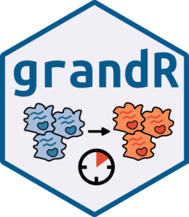

# grandR <a href='https://grandr.erhard-lab.de'></a>

Nucleotide conversion sequencing experiments have been
developed to add a temporal dimension to RNA-seq and single-cell RNA seq. Such 
experiments require specialized tools for primary processing such as GRAND-SLAM,
and specialized tools for downstream analyses. grandR provides a comprehensive 
toolbox for quality control, kinetic modeling, differential gene expression analysis
and visualization of such data.
  
# Installation

grandR is available from [CRAN](https://CRAN.R-project.org/package=grandR). 
Install grandR using the following commands on the R console:

```
install.packages("grandR")
library(grandR)
```

You can also install the development version from github:

```
require("devtools")
devtools::install_github("erhard-lab/grandR")
library(grandR)
```

# System Requirements
grandR should be compatible with Windows, Mac, and Linux operating systems, but we recommend using grandR on a Linux machine, where it has been extensively tested (Ubuntu 22.04). Due to restrictions of the `parallel` package, parallelization (`SetParallel()`) does not work under Windows. grandR runs on standard laptops (multi-core CPUs are recommended and memory requirements depend on the size of your data sets). 

Installing it via `install.packages` or `devtools::install_github` will make sure that the following packages are available:

```
stats, Matrix, ggplot2, grDevices, patchwork, plyr, parallel, reshape2, MASS, cowplot, minpack.lm, lfc, methods, utils, numDeriv
```

Additional packages are optional and important for particular functions:

```
knitr, rmarkdown, circlize, Seurat, ComplexHeatmap, ggrepel, RCurl, DESeq2, clusterProfiler, msigdbr, fgsea, rclipboard, cubature, lamW, DT, RColorBrewer, eulerr, gsl, htmltools, labeling, matrixStats, monocle, VGAM, quantreg, rlang, graphics, scales, shiny
```

With all dependencies available, installation of grandR typically takes less than a minute.

# How to get started

First have a look at the [Getting started](https://grandR.erhard-lab.de/articles/getting-started.html) vignette.

Then, go through the [Differential expression](https://grandR.erhard-lab.de/articles/web/differential-expression.html) or the [Kinetic modeling](https://grandR.erhard-lab.de/articles/web/kinetic-modeling.html) vignette, which provide a comprehensive walk-through of the two main settings of nucleotide conversion experiments.

There are also additional vignettes:

- [Loading data and working with grandR objects](https://grandR.erhard-lab.de/articles/web/loading-data.html): Learn more about programming with grandR
- [Working with data matrices and analysis results](https://grandR.erhard-lab.de/articles/web/data-matrices-and-analysis-results.html): Learn more about how to retrieve data from grandR objects
- [Plotting](https://grandR.erhard-lab.de/articles/web/plotting.html): Learn about the plotting helper functions and the shiny web-interface of grandR

