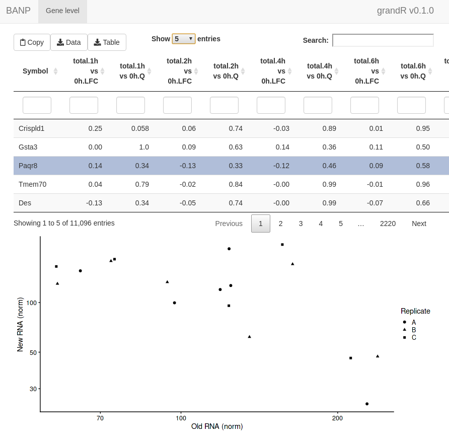
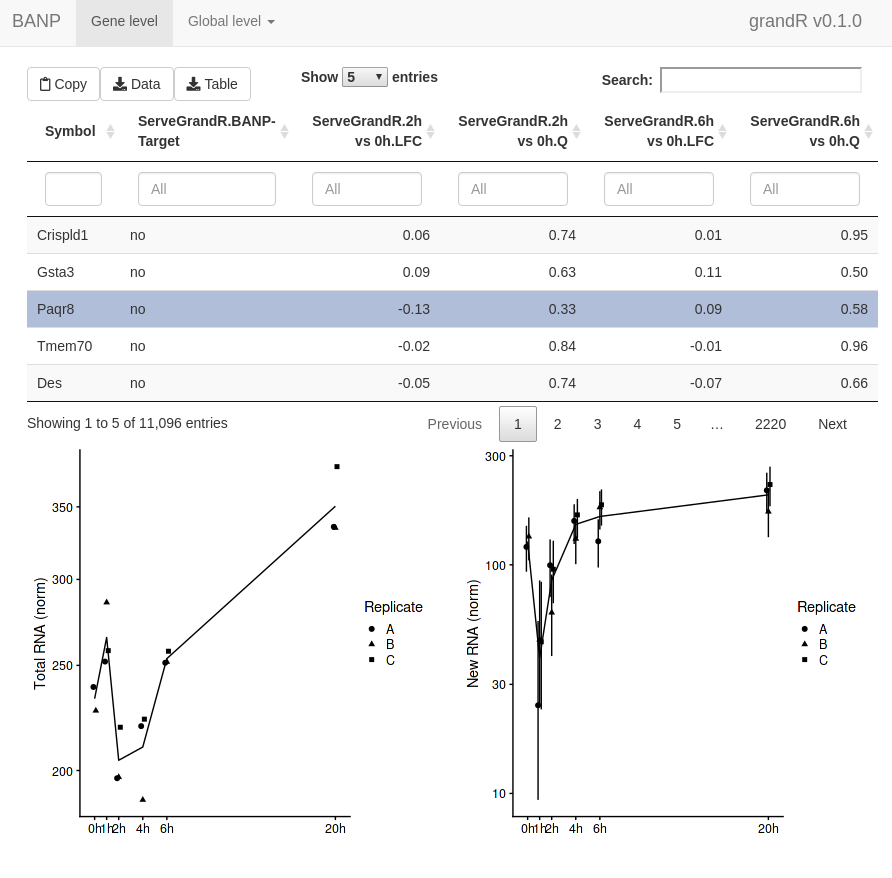
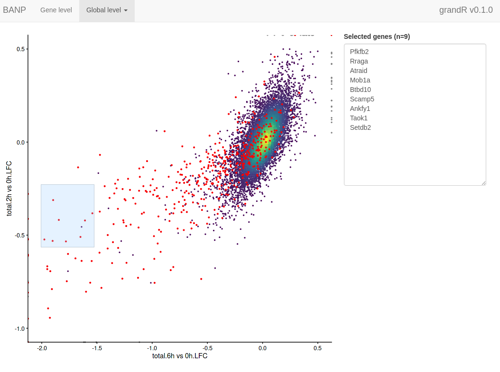

```{r setup, include=FALSE}
knitr::opts_chunk$set(echo = TRUE,comment=NA,R.options=list(width = 95))
```

This vignette will describe how to visualize data using grandR in different scenarios. In addition to QC plots (see the [differential expression](differential-expression.html) and [kinetic modeling](kinetic-modeling.html) vignettes) and vulcano/MA plots (see the [differential expression](differential-expression.html) vignette), the plotting functions in grandR consist of 

  1. Gene-wise visualizations and
  2. Global visualizations (scatter plots, heatmaps)

All plotting functions operate on grandR objects and return ggplot2 and ComplexHeatmap objects, which can, in principle, be further customized (see below). Both kinds of plots can be used in a shiny-based web interface for exploratory data analysis.

# Gene-wise visualizations

All functions that visualize data for a single gene start with `PlotGene`. We demonstrate the first few using the BANP data set [1](https://www.nature.com/articles/s41586-021-03689-8). These are SLAM-seq data from multiple time points (1h,2h,4h,6h and 20h) after acute depletion of BANP. We first load and preprocess these data as usual:

```{r warning=FALSE}
suppressPackageStartupMessages({
    library(grandR)
    library(ggplot2)
    library(patchwork)
})
```
```{r}
banp <- ReadGRAND("https://zenodo.org/record/6976391/files/BANP.tsv.gz",design=c("Cell","Experimental.time","Genotype",Design$dur.4sU,Design$has.4sU,Design$Replicate))
banp <- FilterGenes(banp)
banp <- Normalize(banp)
```
Refer to the [Loading data and working with grandR objects](loading-data.html) vignette to learn more about how to load data.

The most basic plots are to just showing the raw data (from the default slot, by default shown in log scale; both can be changed via parameters):

```{r fig.width=6, warning=FALSE}
PlotGeneTotalVsNtr(banp,"Tubgcp5")
PlotGeneOldVsNew(banp,"Tubgcp5")
```

By default replicates (if present in the `Coldata` table) will be shown as the point shapes, and conditions as colors. Here we do not have a Condition, so let's add this (and show only the new vs. old plot, as this works the same way for the total vs NTR):

```{r fig.width=6, warning=FALSE}
Condition(banp) <- c("Genotype","Experimental.time.original","has.4sU") 
PlotGeneOldVsNew(banp,"Tubgcp5")
```

It is also possible to change the aesthetic mappings (i.e. the usage of shape for replicates and colors for conditions) via the aest parameter and the way they are displayed via ggplot's scales:

```{r fig.width=6, warning=FALSE}
PlotGeneOldVsNew(banp,"Tubgcp5",aest = aes(color=Genotype,shape=factor(duration.4sU)))+
  scale_color_brewer(palette="Dark2")
```

Both plotting functions also offer to plot credible intervals. These must be precomputed using `ComputeNtrCI`. Note here that `PlotGeneOldVsNew` returns a plain ggplot2 object, so we can easily further customize it (here: restrict the y axis, which would otherwise be extended way down due to the large CI of one of the points).

```{r fig.width=6, warning=FALSE}
banp <- ComputeNtrCI(banp) # creates data slots "lower" and "upper"
PlotGeneOldVsNew(banp,"Tubgcp5",show.CI = TRUE)+
  coord_cartesian(ylim=c(30,3000))
```

These visualizations are sometimes hard to interpret. In such situations, it makes sense to only plot either old, new or total RNA on the y axis, and group samples on the x axis. By default, `PlotGeneGroupsPoints` will group the points according to the Condition (which can be changed via the `group` parameter). To demonstrate, we plot new RNA from the norm slot (by using the mode.slot syntax `new.norm` for the mode.slot parameter), show credible intervals, and specify custom colors:

```{r fig.width=6, warning=FALSE}
PlotGeneGroupsPoints(banp,"Tubgcp5",mode.slot="new.norm",show.CI = TRUE,aest=aes(color=Genotype))+
  coord_cartesian(ylim=c(30,3000))+
  scale_color_manual(values=c(wt='gray50',dTag='red'))
```

The last of the basic visualizations shows old (gray) and new (red) RNA as bars (and here we change the way the samples are labeled on the x axis):

```{r fig.width=6}
PlotGeneGroupsBars(banp,"Tubgcp5",xlab=paste(Condition,Replicate,sep="."))
```

grandR also provides more sophisticated plotting function for time courses. A time course can either consist of several snapshots or it can be a progressive labeling time course (i.e. labeling was started at the same time point for each sample, or, in other words, the experimental time is equal to the labeling time). For snapshot data, we can use the `PlotGeneSnapshotTimecourse` function. This function will plot time course per condition, and right now each time point belongs to its own condition as defined above. Thus, we will just remove the condition for now. Furthermore, the wt Genotype doesn't have annotated experimental times, so we remove these samples as well:
```{r}
banp <- subset(banp,columns = Genotype=="dTag")
Condition(banp) <- NULL
```

For `PlotGeneSnapshotTimecourse` we need to define the time parameter corresponding to the experimental time, which is here the time since depleting BANP:
```{r fig.width=6}
PlotGeneSnapshotTimecourse(banp,"Tubgcp5",time="Experimental.time")
```

We can also change this to not plot in log scale, plot new RNA and show credible intervals:

```{r fig.width=6}
PlotGeneSnapshotTimecourse(banp,"Tubgcp5",time="Experimental.time",log=FALSE,
                           mode.slot="new.norm",show.CI = TRUE)
```

If you have multiple conditions, it will automatically show them as colors (here we don't have conditions, so we just treat the replicates as separate conditions; we also show the NTR instead of new RNA):
```{r fig.width=6}
Condition(banp) <- "Replicate"
PlotGeneSnapshotTimecourse(banp,"Tubgcp5",time="Experimental.time",
                           mode.slot="ntr",show.CI = TRUE)
```

These data consist of a timecourse of several snapshots. There is also another kind of timecourse: progressive labeling. This means that the 2h time point also had 2h of labeling, and the 4h timepoint had 4h of labeling etc. Such data can be visualized using `PlotGeneProgressiveTimecourse`. To demonstrate this, we first load and process the data set from Finkel et al. 2021 [[2]](https://www.nature.com/articles/s41586-021-03610-3). The data set contains time series (progressive labeling) samples from a human epithelial cell line (Calu3 cells); half of the samples were infected with SARS-CoV-2 for different periods of time.

```{r}
sars <- ReadGRAND("https://zenodo.org/record/5834034/files/sars.tsv.gz",
                  design=c("Condition",Design$dur.4sU,Design$Replicate),
                  classify.genes = ClassifyGenes(name.unknown = "Viral"))
sars <- FilterGenes(sars) 
sars <- Normalize(sars)
sars <- ComputeNtrCI(sars) # creates data slots "lower" and "upper"
```

Now we can use it to plot time courses. The function will use the `Condition` field and generate a panel (ggplot facet) for each condition. Just like above, here we will also plot credible intervals of the NTR quantification. In addition to data points, the plotting function will also show the model fit. For that to work, here it is important to specify the steady state parameters. For more on this, see the [kinetic modeling](kinetic-modeling.html) vignette.

```{r fig.width=6}
PlotGeneProgressiveTimecourse(sars,"SRSF6",show.CI = TRUE,steady.state=c(Mock=TRUE,SARS=FALSE))
```

We can also fit the kinetic model using the Bayesian method (which inherently assumes steady state, and actually is not appropriate for the "SARS" condition). Note that the visualization changes to indicate that this method does not use the quantification of RNA abundances at all.

```{r fig.width=6}
PlotGeneProgressiveTimecourse(sars,"SRSF6",type="ntr",show.CI = TRUE)
```

Note that the SARS condition, which is not at steady state, is not fit will.

# Global visualizations

grandR implements two convenience functions to create (i) scatter plots and (ii) heat maps from grandR data.

## PlotScatter

Scatter plots are frequently used to provide a global overview over two variables. A straight-forward example is to compare expression values from two samples (i.e., here the `x` and `y` parameters are sample names from the data set):

```{r fig.height=4, fig.width=4}
PlotScatter(banp,x="mESC.0h.dTag.2h.4sU.A",y="mESC.0h.dTag.2h.4sU.B")
```

Note that `PlotScatter` automatically cuts outliers (shown at the upper right corner in gray) to focus on the bulk of the genes (see below how to modify this behavior), and that it shows dense regions (with many genes) by brighter colors. 

`PlotScatter` can also display results from analyses (see the [differential expression](differential-expression.html) and [kinetic modeling](kinetic-modeling.html) vignettes for more information on analyses). To demonstrate, we first create some analyses results:

```{r}
contrasts <- GetContrasts(banp,contrast=c("Experimental.time.original","0h"))
banp <- LFC(banp,name.prefix = "total",contrasts = contrasts)
banp <- PairwiseDESeq2(banp,name.prefix = "total",contrasts = contrasts)
banp <- LFC(banp,name.prefix = "new",contrasts = contrasts,mode="new", normalization = "total")
banp <- PairwiseDESeq2(banp,name.prefix = "new",contrasts = contrasts,mode="new", normalization = "total")
```

Because we need this later, we also add gene annotations about BANP targets determined via ChIP-seq:
```{r}
tar <- readLines("https://zenodo.org/record/6976391/files/targets.genes")
GeneInfo(banp,"BANP-Target")<-factor(ifelse(Genes(banp) %in% tar,"yes","no"),
                                     levels=c("yes","no"))
```


Now we could for instance compare log2 fold change computed for total and new RNA, respectively:

```{r fig.height=4, fig.width=4}
PlotScatter(banp,x="total.6h vs 0h.LFC",y="total.2h vs 0h.LFC")
```

Here, both the `x` and `y` parameters to `PlotScatter` are character strings that are (i) sample (or cell, in case of single cell data) names (like mESC.0h.dTag.2h.4sU.A) or (ii) fully qualified analysis results (like "total.4h vs 0h.LFC"). A fully qualified analysis result is the analysis name (for "total.4h vs 0h.LFC" this is "total.4h vs 0h", which is build by the `LFC` function used above from the name.prefix parameter - "total" - and the name in the used contrast matrix - "4h vs 0h") followed by a dot (".") and the name of the computed statistic (here "LFC"). If you don't know what is available so far in your object, call `Analyses(banp,description=TRUE)`. However, you can also use arbitrary expressions, that are evaluated in an environment that has both the sample names as well as the fully qualified analysis results. Thus, you can also do (if you don't want to use the `VulcanoPlot` function, see the [differential expression vignette](differential-expression.html); note the backticks since the names contain spaces):

```{r fig.height=4, fig.width=4}
PlotScatter(banp,x=`total.2h vs 0h.LFC`,y=-log10(`total.2h vs 0h.Q`))
```

Axes can also be plotted in log scale (there are also parameters called `log.x` and `log.y`), and it is possible to change the axis labels. `PlotScatter` returns a ggplot object, so it is also straight-forward to further adjust the plot to your needs (e.g. like with `ggtitle` here).

```{r fig.height=4, fig.width=4}
PlotScatter(banp,x=`mESC.0h.dTag.2h.4sU.A`,y=`mESC.0h.dTag.2h.4sU.B`,
            xlab="Replicate A",ylab="Replicate B",log=TRUE)+
  ggtitle("0h normalized expression")+
  geom_abline()
```

You might have noticed that the outlier filtering for one of the plots above (the log2 fold change comparison) was too stringent. How stringently outliers are filtered is defined via the `remove.outlier` parameter (the higher, the more points are included and not defined as outliers), or limits can be defined directly via `xlim` and `ylim` (note that we use the pipe "|" and division "/" operators defined in the patchwork package to combine plots):

```{r fig.height=6, fig.width=6}
x="total.6h vs 0h.LFC"
y="total.2h vs 0h.LFC"
(PlotScatter(banp,xcol=x,ycol=y,xlab="",ylab="") | 
   PlotScatter(banp,xcol=x,ycol=y,xlab="",ylab="",remove.outlier = 10)) /
  (PlotScatter(banp,xcol=x,ycol=y,xlab="",ylab="",remove.outlier = FALSE) | 
     PlotScatter(banp,xcol=x,ycol=y,xlab="",ylab="",xlim=c(-2,0.5),ylim=c(-1,0.5)))
```

A specific subset of genes (e.g., BANP targets found by ChIP-seq) can be highlighted and specific genes can be labeled:

```{r fig.height=4, fig.width=4}
PlotScatter(banp,x=`total.6h vs 0h.LFC`,y=`total.2h vs 0h.LFC`,xlim=c(-2,0.5),ylim=c(-1,0.5),
            highlight = GeneInfo(banp,"BANP-Target")=="yes",
            label="Thap7")
```

It is also possible to color points according to an annotation in the `GeneInfo` table (instead of using the colors from estimated point densities):

```{r fig.height=4, fig.width=5}
PlotScatter(banp,x=`total.6h vs 0h.LFC`,y=`total.2h vs 0h.LFC`,xlim=c(-2,0.5),ylim=c(-1,0.5),
            color = "BANP-Target")+
  scale_color_manual("BANP target",values=c(yes="blue",no="gray"))
```

Since in many cases, scatter plots are supposed to show correlated variables, correlation statistics can be easily annotated:

```{r fig.height=4, fig.width=5}
PlotScatter(banp,x=`total.6h vs 0h.LFC`,y=`total.2h vs 0h.LFC`,xlim=c(-2,0.5),ylim=c(-1,0.5),
            correlation = FormatCorrelation("pearson"))
```

Finally, it is also possible to divide the scatter plot up into multiple panels (ggplot "facets"). Note that the point densities as well as correlation statistics are computed separately per panel.

```{r fig.height=3, fig.width=6}
PlotScatter(banp,x=`total.6h vs 0h.LFC`,y=`total.2h vs 0h.LFC`,xlim=c(-2,0.5),ylim=c(-1,0.5),
            correlation = FormatCorrelation("pearson",n.format="%d"),facet=`BANP-Target`)
```

## PlotHeatmap

While scatter plots are frequently used to provide a global overview over two variables, you can use heatmaps to handle more than two variables. grandR provides the `PlotHeatmap` function, which provides convenient access to the [ComplexHeatmap](https://www.bioconductor.org/packages/release/bioc/html/ComplexHeatmap.html) package. In essence, this function does the following

 1. Call the powerful `GetTable` function (see the [Working with data matrices and analysis results](data-matrices-and-analysis-results.html) vignette)
 2. Transform the data matrix
 3. Determine reasonable colors
 4. Use ComplexHeatmap::Heatmap

```{r fig.height=6, fig.width=6}
sig.genes <- GetSignificantGenes(banp,analysis = "total.6h vs 0h")
PlotHeatmap(banp,genes=sig.genes)
```

The sample names might be overly long, so it is possible to change that using the `xlab` parameter (which works the same way as for `PlotGeneGroupsBars`, see above)

```{r fig.width=6}
PlotHeatmap(banp,genes=sig.genes,xlab=paste(Experimental.time.original,Replicate,sep="."))
```

Gene names can be shown by setting the `label.genes` parameter to TRUE. If there are at most 50 genes, they are shown by default:

```{r fig.width=6}
sig.genes2 <- GetSignificantGenes(banp,analysis = "total.6h vs 0h",
                                  criteria = Q<0.05 & abs(LFC)>2)
PlotHeatmap(banp,genes=sig.genes2,xlab=paste(Experimental.time.original,Replicate,sep="."))
```

Instead of Z transforming the matrix as per default, here it might also make sense to show log2 fold changes vs the 0h time point:

```{r fig.width=6}
PlotHeatmap(banp,genes=sig.genes,xlab=paste(Experimental.time.original,Replicate,sep="."),
            transform=Transform.logFC(columns=1:2))
```

Another option is to transform by using a variance stabilizing function:

```{r fig.width=6}
PlotHeatmap(banp,genes=sig.genes,xlab=paste(Experimental.time.original,Replicate,sep="."),
            transform="VST")
```

Note that the coloring changed since VST values are not zero centered. You can change the coloring scheme by the `colors` parameter (use any of the colorbrewer palette names):

```{r fig.width=6}
PlotHeatmap(banp,genes=sig.genes,xlab=paste(Experimental.time.original,Replicate,sep="."),
            colors = "PiYG")
```


Finally, it is also possible to visualize analysis results in a heatmap:

```{r fig.width=6}
PlotHeatmap(banp,type="total",columns = "LFC",genes=sig.genes,transform="no")
```

# Web-based exploratory data analysis

It is straight-forward to explore grandR data in a web-interface:

```{r eval=FALSE}
ServeGrandR(banp)
```



This interface lets you:

 1. Scroll through a table of analysis results
 2. Filter this table
 3. Search this table
 4. Inspect gene plots when selecting a single gene
 5. Copy currently filtered gene names
 6. Download the currently filtered table as tsv file
 7. Download any data slot or analysis table as tsv file


By default, it will show all Q,LFC,Synthesis and Half-life columns from all analyses and only show the `PlotGeneOldVsNew` plot when a gene is selected. We can change this. First, let's define a special analysis named "ServeGrandR", which only contains the Q value and log2 fold change from total 2h and 6h, as well as the BANP target status:

```{r}
tab <- GetAnalysisTable(banp,analyses = "total.[26]h",columns = "LFC|Q")[,-1:-4]
names(tab) <- sub("total.","",names(tab))
banp <- AddAnalysis(banp,"ServeGrandR",tab)
```

If this analysis table is present, this is the only table that is shown. Alternatively, you can set the `table` parameter of `ServeGrandR` to any data frame. Next, we will add two gene plots:

```{r}
plotfun.total <- Defer(PlotGeneSnapshotTimecourse,
                     time="Experimental.time",mode.slot="norm",show.CI = TRUE)
plotfun.new <- Defer(PlotGeneSnapshotTimecourse,
                     time="Experimental.time",mode.slot="new.norm",show.CI = TRUE)
banp <- AddGenePlot(banp,"Total RNA",plotfun.total)
banp <- AddGenePlot(banp,"New RNA",plotfun.new)
```

We use the `Defer` function here to not store a specific plot itself, but the function together with several parameters. See below for more explanation and a template how to use this.

Finally, we will also add a global plot:
```{r}
plotfun.global <- Defer(PlotScatter,x="total.6h vs 0h.LFC",y="total.2h vs 0h.LFC",
                        xlim=c(-2,0.5),ylim=c(-1,0.5),
                        highlight = GeneInfo(banp,"BANP-Target")=="yes")
banp <- AddGlobalPlot(banp,"2h vs 6h",plotfun.global)
```

```{r eval=FALSE}
ServeGrandR(banp)
```

In addition to this first page, the web interface now has a second tab to show the scatter plot. This lets you select genes by drawing rectangles with the mouse:



The selected genes are shown in a box, which makes it very easy to copy one of the gene names, switch to the gene level tab, paste the gene name into the search field and look at this particular gene in detail.

## Recipe for creating web apps

1. Preprocess data as appropriate:

```{r}
data <- ReadGRAND("https://zenodo.org/record/6976391/files/BANP.tsv.gz",
                  design=c("Cell","Experimental.time","Genotype",Design$dur.4sU,Design$has.4sU,Design$Replicate))
data <- FilterGenes(data)
data <- Normalize(data)
data <- ComputeNtrCI(data)

# quality control, see differential expression vignette
contrasts <- cbind(
  GetContrasts(data,contrast=c("has.4sU","4sU","no4sU"),
               columns=Genotype=="wt",no4sU = TRUE,name.format = "4sU effect"), 
  # set up the contrast matrix for compare wt.2h.4sU vs wt.2h.no4sU, as above
  GetContrasts(data,contrast=c("Genotype","dTag","wt"),
               columns=Experimental.time==0,name.format="dTag effect") 
  # set up the contrast matrix for compare dTag vs wt without dTAG13 treatment
)
data <- LFC(data,name.prefix = "QC",contrasts=contrasts)

# differential expression, see differential expression vignette
contrasts <- GetContrasts(data,contrast=c("Experimental.time.original","0h"))
data <- LFC(data,name.prefix = "total",contrasts = contrasts)
data <- PairwiseDESeq2(data,name.prefix = "total",contrasts = contrasts)
data <- LFC(data,name.prefix = "new",contrasts = contrasts,mode="new", normalization = "total")
data <- PairwiseDESeq2(data,name.prefix = "new",contrasts = contrasts,mode="new", normalization = "total")

# add BANP target information
tar <- readLines("https://zenodo.org/record/6976391/files/targets.genes")
GeneInfo(data,"BANP-Target")<-factor(ifelse(Genes(data) %in% tar,"yes","no"),levels=c("yes","no"))
```
2. Create an analysis table named "ServeGrandR" as appropriate:

```{r}
tab <- GetAnalysisTable(data,analyses = "total.[26]h",columns = "LFC|Q")[,-1:-4]
names(tab) <- sub("total.","",names(tab))
data <- AddAnalysis(data,"ServeGrandR",tab)
```

3. Come up with useful global plots:

```{r}
PlotScatter(data,x=`QC.4sU effect.LFC`,y=`QC.dTag effect.LFC`,xlim=c(-1.4,1.4),ylim=c(-1.5,1.1))+
  ggtitle("QC")
PlotScatter(data,x=`total.6h vs 0h.LFC`,y=`total.2h vs 0h.LFC`,xlim=c(-2,0.5),ylim=c(-1,0.5),
            highlight = GeneInfo(banp,"BANP-Target")=="yes")+
  ggtitle("Regulation")
```

4. Add them as deferred plots to the grandR object:

```{r}
qc.plot <- Defer(PlotScatter,x="QC.4sU effect.LFC",y="QC.dTag effect.LFC",
                 xlim=c(-1.4,1.4),ylim=c(-1.5,1.1),add = list(ggtitle("QC")))
reg.plot <- Defer(PlotScatter,x="total.6h vs 0h.LFC",y="total.2h vs 0h.LFC",
                  xlim=c(-2,0.5),ylim=c(-1,0.5),
                  highlight = GeneInfo(banp,"BANP-Target")=="yes",
                  add = list(ggtitle("Regulation")))


data <- AddGlobalPlot(data,"QC",qc.plot)
data <- AddGlobalPlot(data,"Regulation",reg.plot)
```

To create a deferred function from the `PlotScatter` commands from above, use the following scheme:

```{r eval=FALSE}
PlotScatter(data,PARAMS)+gg1+...+ggn
-->
Defer(PlotScatter,PARAMS,add=list(gg1,...,ggn))
```

It is important that the `x` and `y` parameters of `PlotScatter` must not be expressions, but characters when used in deferred functions (note the quotation marks as opposed to the backticks above).

Do *not* execute these deferred functions (otherwise they would cache the plot which would increase the file size and loading times in the end).

5. Come up with useful gene plots (just test them with an example gene)

```{r warning=FALSE}
PlotGeneGroupsBars(data,"Tubgcp5",columns = Genotype=="wt")
PlotGeneSnapshotTimecourse(data,"Tubgcp5",columns = Genotype=="dTag",
                     time="Experimental.time",mode.slot="norm",show.CI = TRUE)
PlotGeneSnapshotTimecourse(data,"Tubgcp5",columns = Genotype=="dTag",
                     time="Experimental.time",mode.slot="new.norm",show.CI = TRUE)
```

6. Add them as deferred plots to the grandR object as above.

```{r}
wt.col <- Coldata(data,"Genotype")=="wt"
dtag.col <- Coldata(data,"Genotype")=="dTag"

plotfun.qc <- Defer(PlotGeneGroupsBars,columns = wt.col)
plotfun.total <- Defer(PlotGeneSnapshotTimecourse,
                     time="Experimental.time",mode.slot="norm",show.CI = TRUE,
                     columns = dtag.col)
plotfun.new <- Defer(PlotGeneSnapshotTimecourse,
                     time="Experimental.time",mode.slot="new.norm",show.CI = TRUE,
                     columns = dtag.col)

data <- AddGenePlot(data,"QC",plotfun.qc)
data <- AddGenePlot(data,"Total RNA",plotfun.total)
data <- AddGenePlot(data,"New RNA",plotfun.new)
```

To create a deferred function from any `PlotGeneXYZ` commands from above, use the following scheme:

```{r eval=FALSE}
PlotGeneXYZ(data,"<Gene>",PARAMS)+gg1+...+ggn
-->
Defer(PlotGeneXYZ,PARAMS,add=list(gg1,...,ggn))
```

Again, if any of the parameters are expressions (like `columns` above), you need to change this, as this is not supported by `Defer`.

Do *not* execute these deferred functions (otherwise they would cache the plot which would increase the file size and loading times in the end).

7. Save your grandR object to a file
```{r eval=FALSE}
saveRDS(data,"data.rds")
```

8. Deploy the "data.rds" and the following `app.R` on your shiny server

```{r eval=FALSE}
library(grandR)
ServeGrandR("data.rds",sizes = c(2,4,4))
```
This server is available [here](http://einstein.virologie.uni-wuerzburg.de:3839/BANP/).

# Deferred functions

Let's say you want to show a scatter plot on the web interface:

```{r}
PlotScatter(data,x=`total.6h vs 0h.LFC`,y=`total.2h vs 0h.LFC`,xlim=c(-2,0.5),ylim=c(-1,0.5),
            highlight = GeneInfo(banp,"BANP-Target")=="yes")+
  ggtitle("Regulation")
```

First idea is to pre-compute it and store the ggplot object alongside with the grandR object.

```{r}
plot.reg <- PlotScatter(data,x=`total.6h vs 0h.LFC`,y=`total.2h vs 0h.LFC`,xlim=c(-2,0.5),ylim=c(-1,0.5),
            highlight = GeneInfo(banp,"BANP-Target")=="yes")+
  ggtitle("Regulation")

print(object.size(plot.reg),units="Mb")
```
This object is surprisingly large in memory, which means also surprisingly large when written to a rds file, which means also surprisingly slow to load whenever shiny displays the website.

However, it is of course not necessary to precompute it, it can of course be computed on the fly (since all necessary data is there!). A solution would therefore be to just store a function that generates the ggplot:

```{r}
f1 <- function() PlotScatter(data,x=`total.6h vs 0h.LFC`,y=`total.2h vs 0h.LFC`,
                             xlim=c(-2,0.5),ylim=c(-1,0.5),
                             highlight = GeneInfo(banp,"BANP-Target")=="yes")+
                        ggtitle("Regulation")

print(object.size(f1),units="b")
```
Perfect, now we can implement our web interface to just call the function when the plot is supposed to be shown:

```{r}
f1()
```
```{r}
time.precomp <- system.time({ print(plot.reg) })[3]
time.f1 <- system.time({ print(f1()) })[3]
cat(sprintf("Time for precomputed plot: %.3fms\nTime for function: %.3fms",time.precomp,time.f1))
```

We can also do this without actually plotting:

```{r}
time.precomp <- system.time({ plot.reg })[3]
time.f1 <- system.time({ f1() })[3]
cat(sprintf("Time for precomputed plot: %.3fms\nTime for function: %.3fms",time.precomp,time.f1))
```

This is quite slow (just imagine you have many plots, more data, or more complicated plots, and the server is already busy; Heatmaps are even worse, actually!). Enter deferred functions:

```{r}
f2 <- Defer(PlotScatter,x="total.6h vs 0h.LFC",y="total.2h vs 0h.LFC",
                  xlim=c(-2,0.5),ylim=c(-1,0.5),
                  highlight = GeneInfo(banp,"BANP-Target")=="yes",
                  add = list(ggtitle("Regulation")))
print(object.size(f2),units="b")
```
This is nothing, and it won't get larger if you have more complex plots.

```{r}
time.precomp <- system.time({ plot.reg })[3]
time.f1 <- system.time({ f1() })[3]
time.f2.first <- system.time({ f2(data) })[3]
time.f2.second <- system.time({ f2(data) })[3]
cat(sprintf("Time for precomputed plot: %.3fms\nTime for function: %.3fms\nTime for deferred (1st time): %.3fms\nTime for deferrend (2nd time): %.3fms",time.precomp,time.f1,time.f2.first,time.f2.second))
```

Thus, the first time the deferred function is called, the plot  is created and then cached, if it's called again, the cached version is used. This behavior can be further examined using the following examples:

```{r}
fun <- function(data) rnorm(5,mean=data)
f1=Defer(fun)
f2=function(d) fun(d)
f2(4)
f2(4) # these are not equal, as rnorm is called twice
f1(4)
f1(4) # these are equal, as the result of rnorm is cached
```
